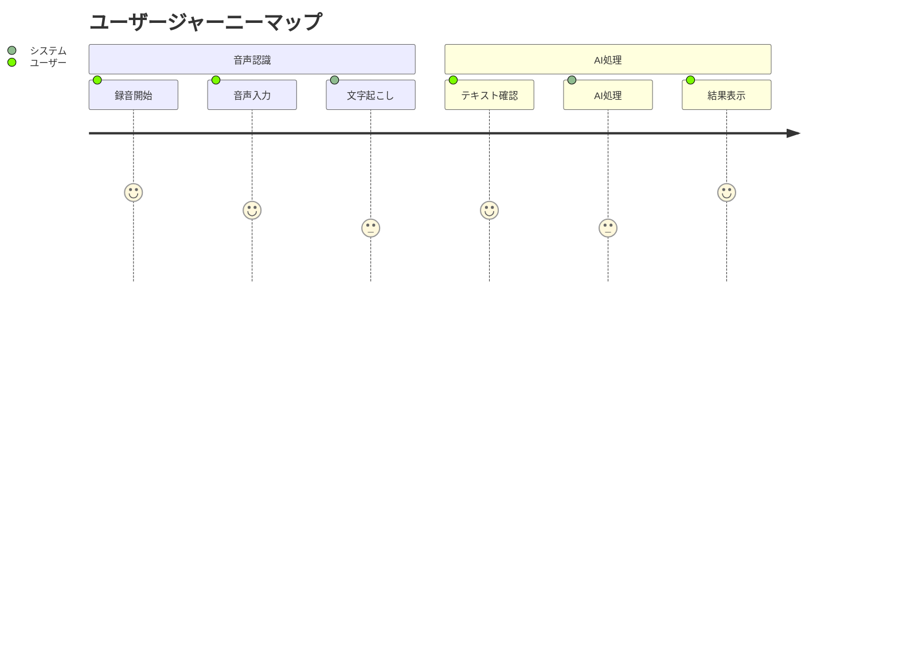

# プロダクトコンテキスト

## ユーザーペルソナ

### プライマリーペルソナ
1. **一般ユーザー**
   - 音声入力を活用したい
   - テキスト生成の効率化を求める
   - シンプルな操作性を重視

2. **ビジネスユーザー**
   - 会議や議事録の文字起こし
   - AIによる要約や分析が必要
   - 高い処理精度を要求

## ユーザージャーニー

## ユーザー体験目標
1. **シンプルさ**
   - ワンクリックでの録音開始
   - リアルタイムな文字起こし表示
   - 直感的なUI/UX

2. **スピード**
   - 即時の音声認識
   - リアルタイムなフィードバック
   - 高速なAI処理

3. **品質**
   - 正確な音声認識
   - 適切なAI処理結果
   - エラー時の適切なフィードバック

4. **信頼性**
   - 安定した音声認識
   - 確実なセッション管理
   - データの永続性

## 機能優先順位
### P0（必須機能）
- 音声認識と文字起こし
- AIテキスト処理
- リアルタイム表示
- 基本的なエラーハンドリング

### P1（重要機能）
- セッション管理
- 処理結果の保存
- 進行状況表示
- 言語切り替え

### P2（追加機能）
- 認識精度の設定
- カスタムAIプロンプト
- 処理履歴の表示
- エクスポート機能

## 品質基準
### コンテンツ品質
1. **音声認識**
   - 95%以上の認識精度
   - リアルタイムな表示更新
   - 適切なエラーハンドリング

2. **AI処理**
   - 文脈を考慮した処理
   - 一貫した応答品質
   - ユーザーフレンドリーな結果表示

### システム品質
1. **パフォーマンス最適化**
   - Web Speech APIの効率的な利用
   - Server Componentsの活用
   - クライアントサイドの最適化

2. **システム信頼性**
   - セッション管理の確実性
   - エラー時の適切な回復
   - データの永続性確保

## フィードバックと改善
1. **ユーザー体験モニタリング**
   - 音声認識の精度
   - AI処理の品質
   - UI/UXの使いやすさ

2. **システムモニタリング**
   - 音声認識のレイテンシー
   - AI処理の応答時間
   - エラー発生率

3. **継続的改善プロセス**
   - ユーザーフィードバックの収集
   - システムパフォーマンスの最適化
   - 機能の段階的な拡張
