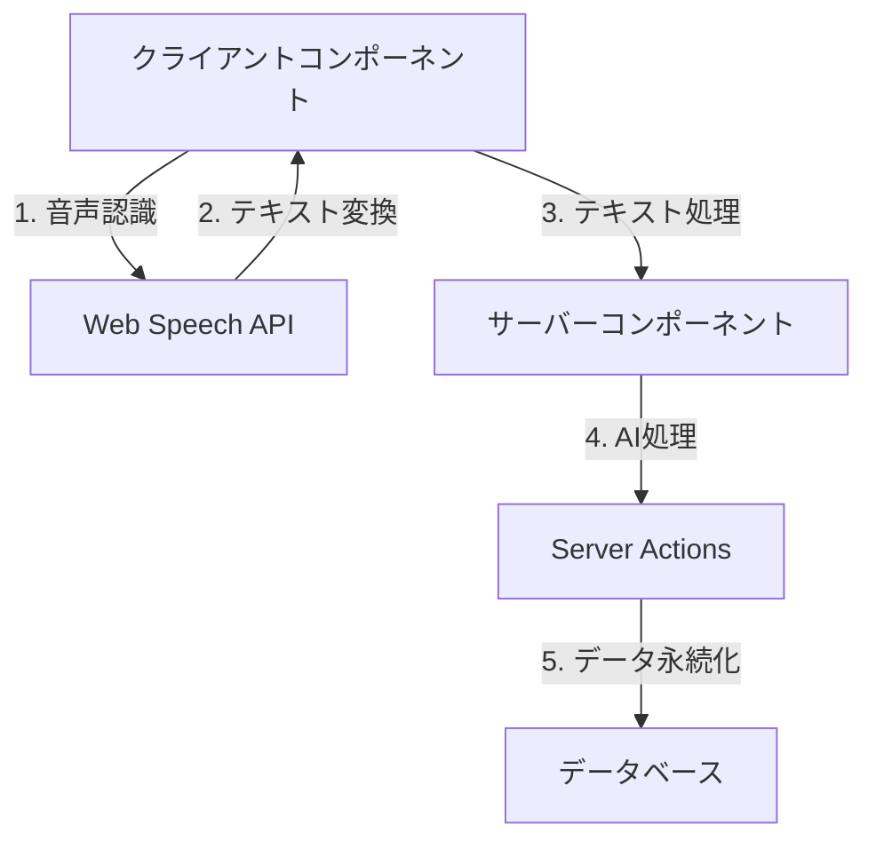
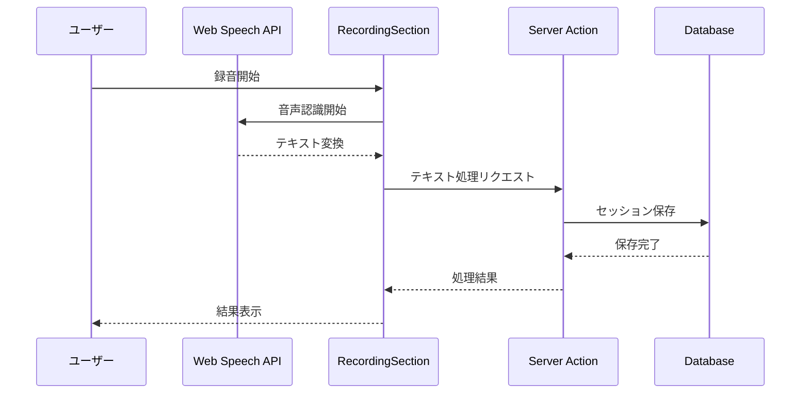

# システムパターン設計

## アーキテクチャ概要


## システムレイヤー
### 1. プレゼンテーション層
- Server Componentsを優先使用
- Client Componentsは音声認識など必要な機能のみに限定
- アトミックデザインベースのコンポーネント構造
  ```
  components/
  ├── atoms/
  │   └── RecordButton.tsx
  ├── molecules/
  │   ├── TranscriptDisplay.tsx
  │   └── AIResponseDisplay.tsx
  └── client/
      └── RecordingSection.tsx
  ```

### 2. サーバーサイド構造
- Server Actionsによるテキスト処理
  ```
  actions/
  └── processTranscript.ts
  ```
- セッション管理
  ```
  lib/
  └── session.ts
  ```

### 3. データ層
- Drizzle ORMによるデータ管理
  ```
  db/
  ├── index.ts
  └── schema.ts
  ```
- マイグレーション管理
  ```
  drizzle/
  ├── 0000_sweet_spirit.sql
  ├── 0001_cuddly_synch.sql
  └── 0002_aberrant_millenium_guard.sql
  ```

## データフロー


## 実装パターン
### 1. 音声認識パターン
```typescript
// カスタムフック実装
const useVoiceRecognition = () => {
  // Web Speech API実装
  // ステート管理
  // 音声認識制御
};
```

### 2. Server Actionパターン
```typescript
// テキスト処理アクション
export async function processTranscript(text: string) {
  // AI処理
  // データ永続化
  // 結果返却
}
```

### 3. セッション管理パターン
```typescript
// セッションサービス
export class SessionManager {
  // セッション作成
  // 状態管理
  // データ永続化
}
```

## エラー処理
1. **音声認識エラー**
   - 認識失敗時のリトライ
   - ユーザーへのフィードバック
   - フォールバック手段の提供

2. **AI処理エラー**
   - リクエスト制限の管理
   - エラー時の代替レスポンス
   - 処理状態の表示

3. **セッションエラー**
   - セッション復旧メカニズム
   - データ整合性の確保
   - エラーログの記録

## パフォーマンス最適化
1. **音声認識**
   - ストリーミング処理の最適化
   - メモリ使用量の管理
   - バッファリング制御

2. **Server Components**
   - 適切なキャッシング戦略
   - 選択的ハイドレーション
   - ストリーミングレンダリング

3. **データ管理**
   - クエリの最適化
   - インデックス設計
   - コネクションプール管理

## セキュリティ考慮事項
1. **入力検証**
   - 音声データの検証
   - テキストサニタイズ
   - パラメータバリデーション

2. **セッション保護**
   - トークン管理
   - タイムアウト制御
   - CSRF対策

3. **データ保護**
   - 暗号化
   - アクセス制御
   - 監査ログ

## 拡張性への配慮
1. **新機能追加**
   - モジュラー設計
   - プラグインアーキテクチャ
   - 設定の外部化

2. **スケーリング**
   - 水平スケーリング対応
   - キャッシュ戦略
   - 負荷分散設計

3. **カスタマイズ**
   - 設定可能なパラメータ
   - フック機構
   - APIの抽象化
