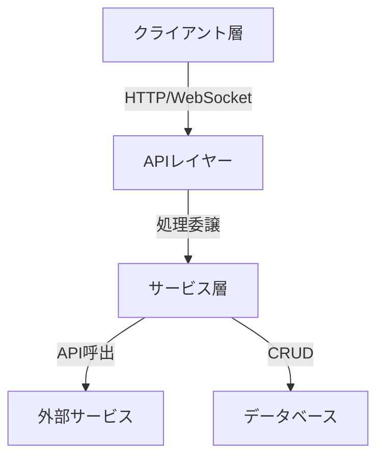
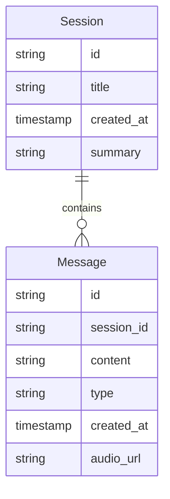

# システムパターン設計

## アーキテクチャ概要


## 主要コンポーネント構成
1. クライアント層（Next.js）
   - ページコンポーネント
   - 共通UIコンポーネント
   - カスタムフック
   - 状態管理（React Query）

2. APIレイヤー（Next.js API Routes）
   - エンドポイント定義
   - バリデーション
   - エラーハンドリング
   - レスポンス整形

3. サービス層
   - 音声処理サービス
   - AI対話サービス
   - セッション管理サービス
   - データアクセスサービス

4. 外部サービス連携
   - OpenAI Whisper API
   - OpenAI GPT-4 API
   - Supabase

## データモデル


## 技術スタック選定理由
1. Next.js
   - App Routerによる最新機能
   - APIルートの統合
   - SSRとCSRの柔軟な選択
   - TypeScript完全サポート

2. Supabase
   - スキーマレス対応
   - リアルタイム機能
   - 認証機能（将来対応）
   - PostgreSQLベース

3. TailwindCSS
   - 高速な開発
   - カスタマイズ容易
   - レスポンシブ対応
   - ユーティリティファースト

## 設計パターン
1. Atomic Design
   - コンポーネント分割の方針
   - 再利用性の向上
   - 保守性の確保

2. Custom Hooks
   - ロジック分離
   - 状態管理
   - 再利用性

3. Repository Pattern
   - データアクセス抽象化
   - テスト容易性
   - 依存性の制御

## API設計
1. RESTful API
   ```typescript
   // セッション関連
   POST   /api/sessions
   GET    /api/sessions
   GET    /api/sessions/:id
   PUT    /api/sessions/:id
   DELETE /api/sessions/:id

   // メッセージ関連
   POST   /api/sessions/:id/messages
   GET    /api/sessions/:id/messages
   PUT    /api/messages/:id
   DELETE /api/messages/:id

   // 音声処理
   POST   /api/speech-to-text
   ```

2. WebSocket（将来対応）
   ```typescript
   // リアルタイムメッセージ
   ws://api/sessions/:id/realtime
   ```

## セキュリティ考慮事項
1. 入力データ検証
   - zod/yupによるバリデーション
   - サニタイズ処理
   - CSRF対策

2. API保護
   - レート制限
   - CORS設定
   - APIキー管理

3. データ保護
   - 暗号化
   - アクセス制御
   - バックアップ
